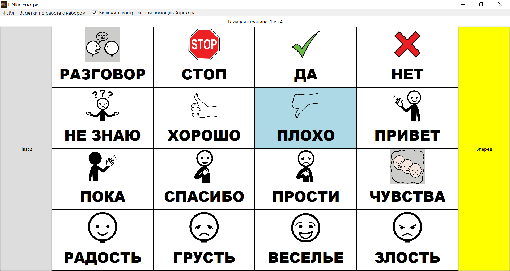
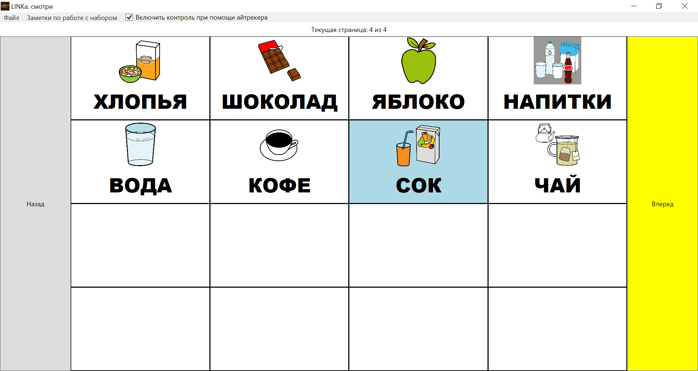
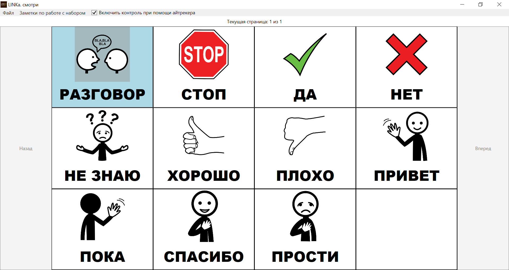
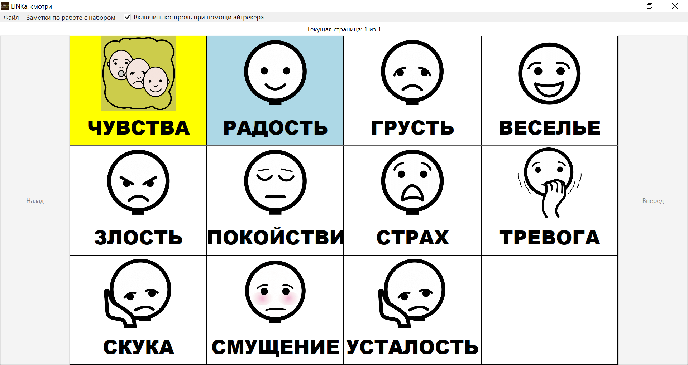
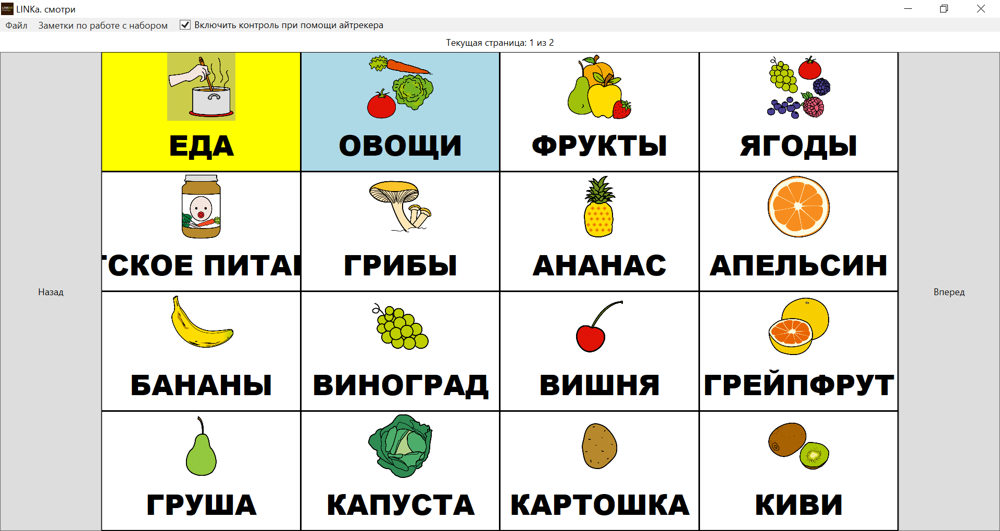
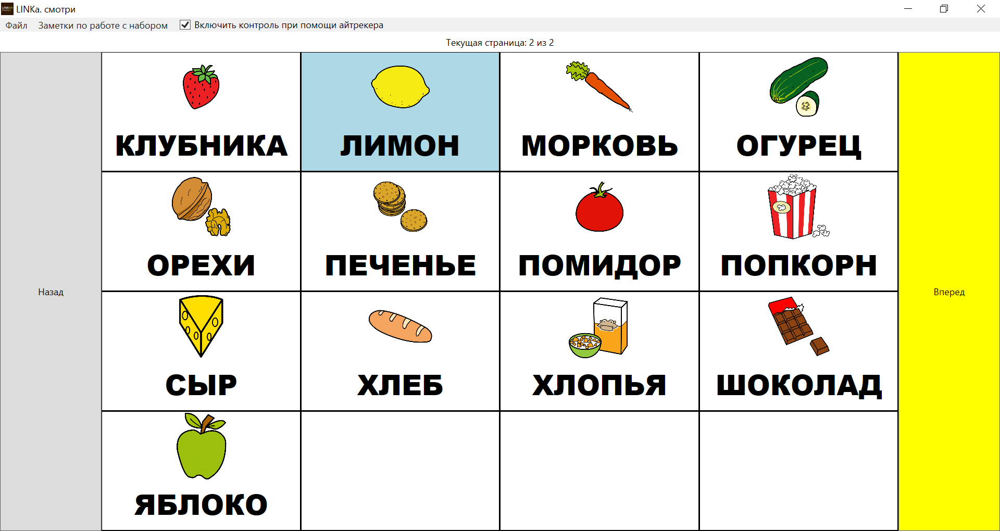
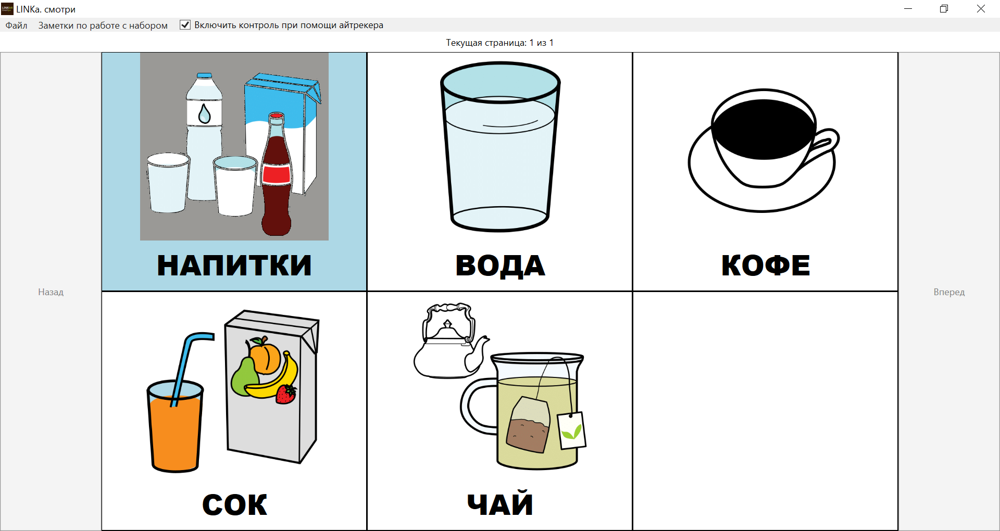

# Карточки для LINKA.Looks

Здесь расположены _.linka_-карточки для программы __"LINKa. смотри"__ <https://linka.su/looks/>. 

Исходники оригинальной программы —  <https://github.com/linkasu/LINKa.look-windows>. Мой форк программы — <https://github.com/pasha-liubetski/LINKa.look-windows>, там этот набор карточек используется по умолчанию.

Для генерации _.linka_-файлов использую самописные скрипты __linka_gen:__ <https://github.com/pasha-liubetski/linka_gen>.

## Авторство и лицензия

Изображения — ARASAAC (Aragonese Center of Augmentative and Alternative Communication, https://arasaac.org/pictograms/search), лицензия — Creative Commons License BY-NC-SA.

Карточки для LINKa — Паша Любецкий <mailto:pasha.liubetski@yandex.com>, лицензия — _Creative Commons Attribution 4.0 International (CC-BY 4.0)_.

# Все

# Разговор

__Порядок карточек:__

- стоп
- да
- нет
- не знаю
- хорошо
- плохо
- привет
- пока
- спасибо
- прости

# Чувства

__Порядок карточек:__

- радость
- грусть
- веселье
- злость
- спокойствие
- страх
- тревога
- скука
- смущение
- усталость

# Еда

__Порядок карточек:__

- овощи
- фрукты
- ягоды
- детское питание
- грибы
- ананас
- апельсин
- бананы
- виноград
- вишня
- грейпфрут
- груша
- капуста
- картошка
- киви
- клубника
- лимон
- морковь
- огурец
- орехи
- печенье
- помидор
- попкорн
- сыр
- хлеб
- хлопья
- шоколад

# Напитки

__Порядок карточек:__

- вода
- кофе
- сок
- чай
